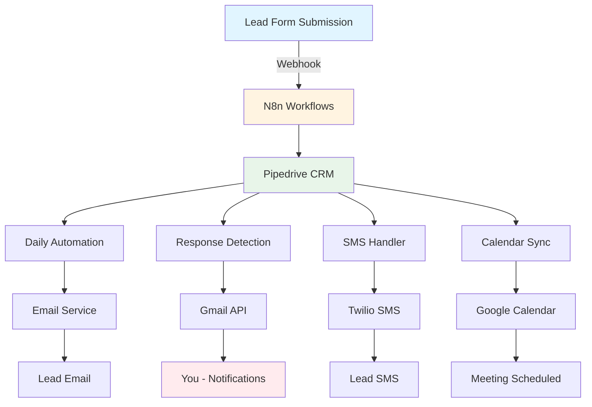
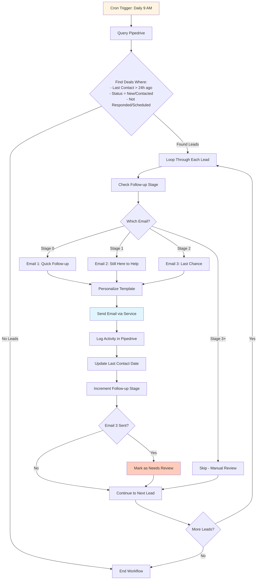
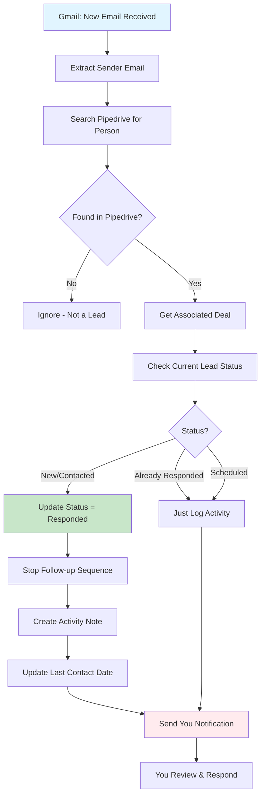
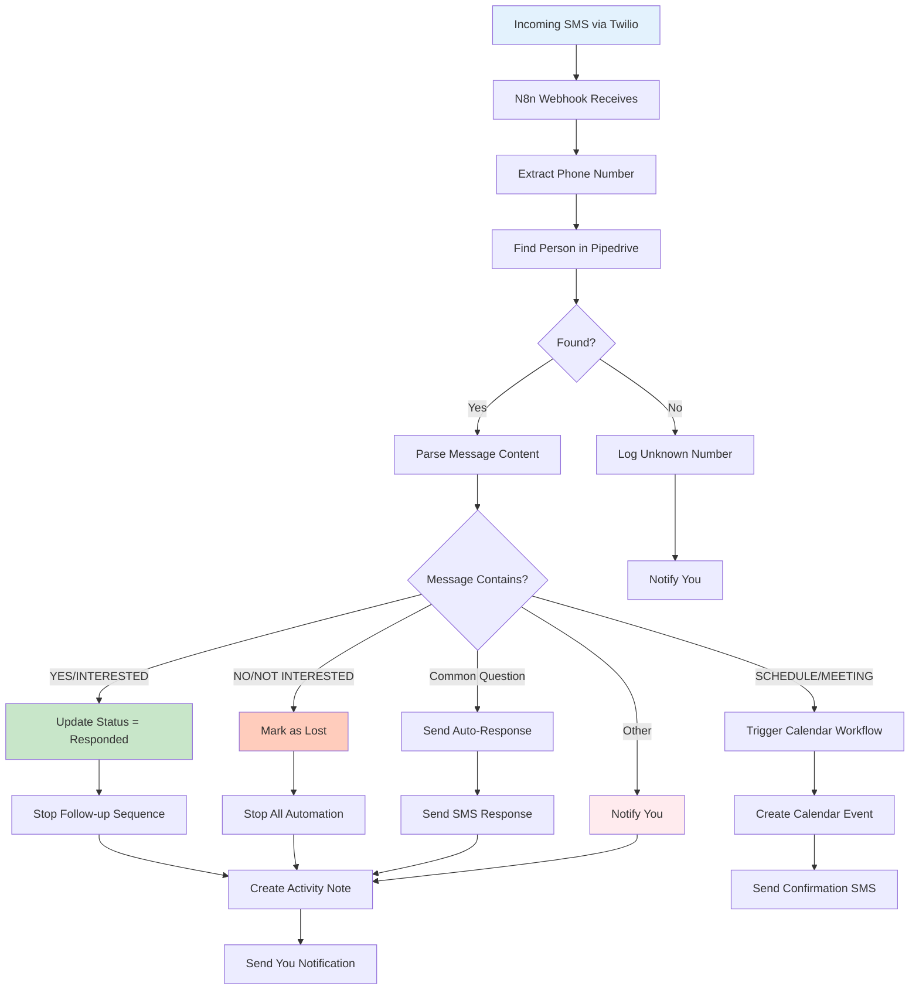
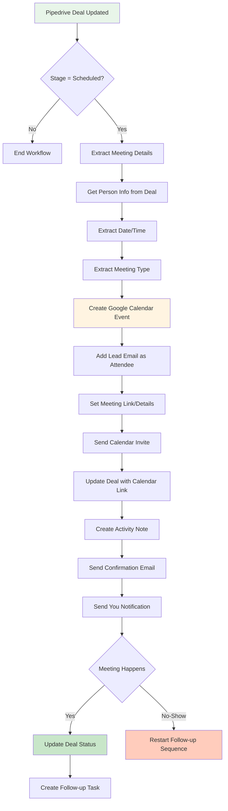
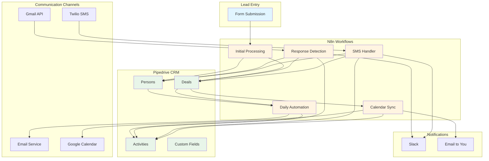
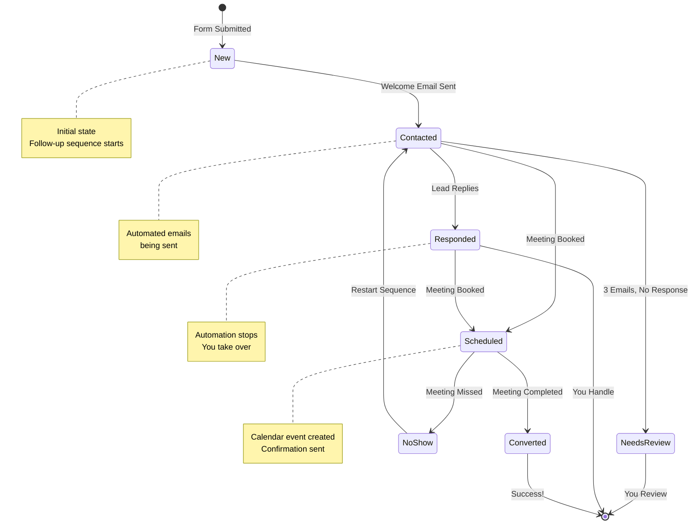
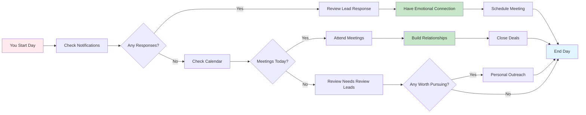

# 🚀 Complete Automation System Overview

## System Architecture - High Level

---

## 📋 Lead Lifecycle Flow

```mermaid
graph LR
    A[New Lead Submits Form] --> B[N8n Receives Data]
    B --> C[Create Pipedrive Person]
    C --> D[Create Pipedrive Deal]
    D --> E[Set Custom Fields]
    E --> F[Send Welcome Email]
    F --> G[Schedule First Follow-up]
    
    G --> H{24 Hours Pass}
    H -->|Yes| I[Check Lead Status]
    I --> J{Has Responded?}
    J -->|No| K[Send Follow-up Email 1]
    J -->|Yes| L[Stop Sequence]
    
    K --> M{48 Hours Pass}
    M -->|Yes| N{Still No Response?}
    N -->|No| L
    N -->|Yes| O[Send Follow-up Email 2]
    
    O --> P{72 Hours Pass}
    P -->|Yes| Q{Still No Response?}
    Q -->|No| L
    Q -->|Yes| R[Send Follow-up Email 3]
    
    R --> S[Mark for Manual Review]
    S --> T[You Take Over]
    
    style A fill:#e1f5ff
    style L fill:#c8e6c9
    style S fill:#ffccbc
    style T fill:#ffebee
```

---

## ⏰ Daily Automation Workflow (Runs Every 24 Hours)

---

## 📧 Response Detection & Sequence Management

---

## 💬 SMS Automation Flow

---

## 📅 Calendar Integration Flow

---

## 🔄 Complete System Integration Map

---

## 📊 Data Flow: Lead Status Transitions

---

## 🎯 Your Daily Workflow (What You Actually Do)

---

## 📝 Key Automation Rules Summary

### ✅ When Automation STOPS:
- Lead responds to email
- Lead schedules meeting
- Lead status = "Responded" or "Scheduled"
- Lead explicitly opts out
- 3 follow-up emails sent with no response

### 🔄 When Automation RESUMES:
- Meeting canceled → Resume sequence
- No-show → Restart after 24 hours
- Manual status reset by you

### ⏱️ Timing:
- **Welcome Email:** Immediately after form submission
- **Follow-up 1:** 24 hours after submission
- **Follow-up 2:** 48 hours after Follow-up 1
- **Follow-up 3:** 72 hours after Follow-up 2
- **Daily Check:** Every day at 9 AM

---

## 🛠️ Tools & Services Needed

| Tool | Purpose | Cost Estimate |
|------|---------|---------------|
| **N8n** | Workflow automation (already have) | Included |
| **Pipedrive** | CRM (already integrated) | Included |
| **Gmail API** | Email sending/receiving | Free |
| **Twilio** | SMS sending/receiving | ~$0.0075/SMS |
| **Google Calendar** | Calendar management | Free |
| **Slack** | Notifications | Free tier available |
| **SendGrid/Mailgun** | Transactional emails (optional) | Free tier available |

---

## 📈 Expected Results

After full implementation:
- ✅ **100% automated** follow-up sequence
- ✅ **Zero manual** email sending needed
- ✅ **Instant notifications** when leads respond
- ✅ **Automatic** calendar management
- ✅ **Smart** SMS handling
- ✅ **Your time** focused on relationships, not admin

---

*This visual overview shows how all your systems work together to automate your triage process, leaving you free to focus on building emotional connections with leads.*

